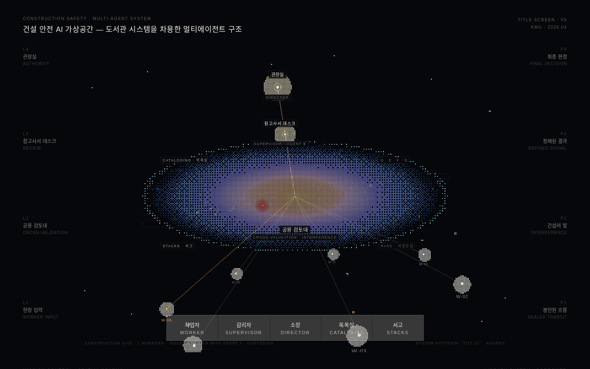

# 안전 가상공간 — Safety Space

건설 안전 멀티에이전트 AI 시스템을 **도서관 공간 은유**로 시각화한 웹 프로토타입.

> **핵심 명제 — 상호 가시성을 통한 분산된 책임 (Distributed Accountability through Mutual Visibility)**
> 작업자는 서로에게 비가시(담합·동조 압력 차단), 감리자에게는 가시, 감리자는 소장에게 가시.
> 이 **비대칭 가시성 구조**가 시스템 전체의 공간 설계를 지배한다.

## 라이브 데모

- **GitHub Pages:** https://banhangsim.github.io/safety-space/
- **Vercel:** https://yangwook-final-0616.vercel.app

권장 환경: 데스크톱 브라우저 (Chrome / Safari). 단일 HTML 파일이며 Three.js(CDN) 외 의존성이 없다.

## 체험 방법

타이틀 화면의 전체 도식에서 출발한다.

1. **역할 버튼** — 작업자 / 감리자 / 소장 → 각 방으로 줌-인 진입 (진입의 의례)
2. **노드 클릭** — 도식의 `CATALOGING · 목록실`, `STACKS · 서고` 라벨 클릭 → 시스템 방 진입
3. 모든 방에서 `←` 로 타이틀 복귀 — **역할 사이 이동은 항상 전체 도식을 경유한다**

각 위치에서 *무엇이 보이고 무엇이 보이지 않는지*를 몸으로 알게 되는 것이 이 공간의 목적이다.

## 여섯 개의 방

| 방 | 시스템 레이어 | 상태 |
|---|---|---|
| 열람실 (Reading Room) | Worker Input Layer | 구현 |
| 참고사서 데스크 (Reference Librarian's Desk) | Supervisor Review Layer | 구현 |
| 관장실 (Director's Office) | Authority Control Layer | 구현 |
| 목록실 (Cataloguing Room) | Agent Orchestration Layer | 구현 |
| 서고 (Stacks) | Raw Evidence Archive | 구현 |
| 반납대 (Return Desk) | Site Control Output Layer | **미구현 (열린 과제)** |

상세: [docs/02-rooms.md](docs/02-rooms.md)

## 문서

- [01 — 논제와 이론적 기반](docs/01-thesis.md)
- [02 — 여섯 개의 방](docs/02-rooms.md)
- [03 — 설계 결정 기록 (Design Log)](docs/03-design-log.md)

## 연구 맥락

박사 연구 *"비일상적 도시 경험 공간이 사회적 연결을 만드는가"* 의 대칭 명제로서,
이 프로젝트는 *"비일상적 디지털 공간이 어떻게 일상적 공간 문법을 빌려 신뢰를 만드는가"* 를 탐구한다.
물리 공간에서 '누가 누구를 보는가'가 커뮤니티의 문법이라면, 이 시스템에서는 그것이 안전의 문법이다.

## 기술

- 단일 자체완결 HTML (약 245KB) — 빌드 과정 없음
- Three.js r128 (CDN, 타이틀·진입 화면)
- 의존성 없는 캔버스 Bayer 4×4 디더 렌더링 엔진 (방 화면)
- 폰트: Inter + Pretendard

## 저자

유양욱 (반항심) — 국민대학교 대학원 공간디자인학과 박사과정 · 반항심 디자인 스튜디오
/프로토타입 구현: Claude (Anthropic) 와의 협업
