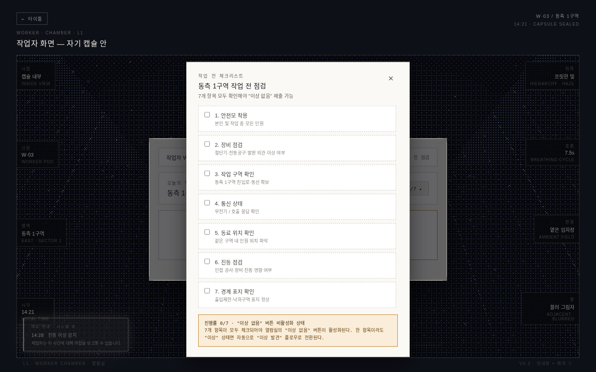
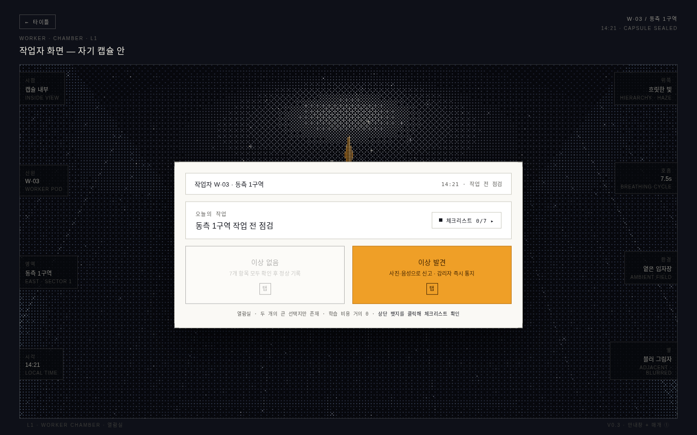
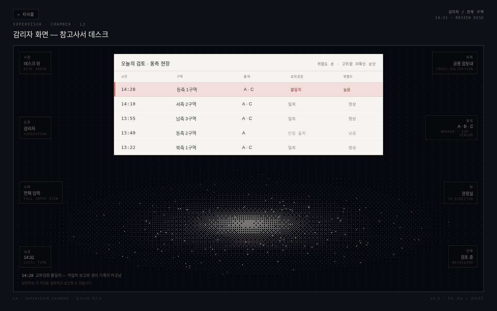
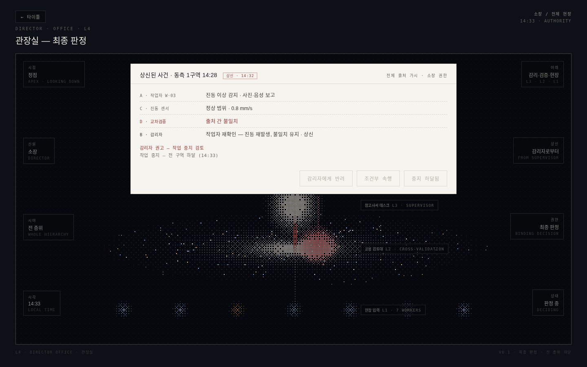
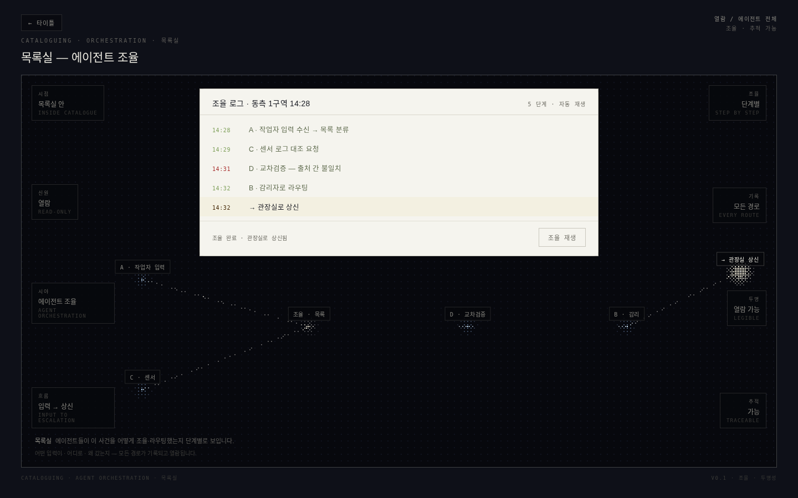
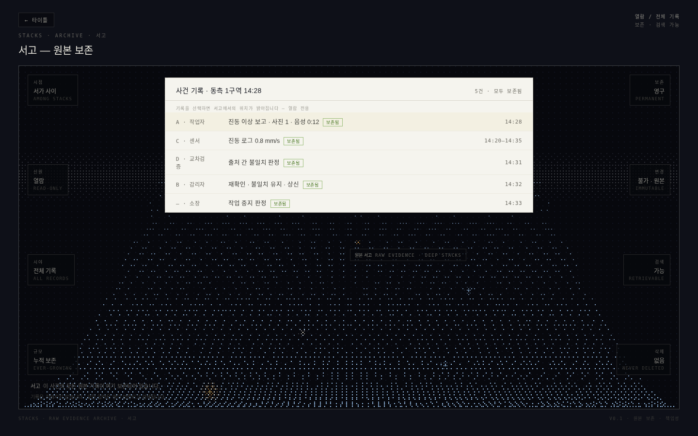

# 02 · 여섯 개의 방

**한국어** | [English](02-rooms.en.md)

하나의 건물, 여섯 개의 방, 세 종류의 경로.

- **사용자 공간** — 열람실 ↔ 반납대
- **관찰자 공간** — 참고사서 데스크 ↔ 관장실
- **시스템 공간** — 목록실 · 서고 (역할 버튼이 아닌 도식의 노드 클릭으로 진입 — 사람의 자리가 아니라 시스템의 자리이므로)

역할의 방은 *경험*을, 시스템의 방은 *정당성*(투명성·책임성)을 담당한다.

---

## 열람실 (Reading Room) — Worker Input Layer

작업자 화면은 **블러 유리로 된 한 칸**이다.

- 자기 캡슐 안. 옆 작업자들은 블러 너머의 *움직이는 그림자*로만 존재 — 외롭지 않지만 분리되어 있음
- 위쪽은 흐릿하게 닫혀 있고, 자기 입력의 순간에만 위로 통로가 잠시 열림
- 중앙에 안전 체크리스트(7항목, 통과/미통과 토글)와 별도의 *이상 발견* 버튼

**매개의 5구간.** 입력에서 응답까지가 즉각 처리되지 않고 다섯 시간 구간을 거친다 —
① 입력의 순간(1초, 철회 가능) → ② 봉인된 흐름(2~3초, 철회 시 기록됨) → ③ 진입(0.5~1초)
→ ④ 자기 응답 도달(3~4초) → ⑤ 통제 명령 도달(4~5초).
이 시간들은 효율이 아니라 *체험적 무게*를 위한 것이다.

**유체 vs 결정.** 자기 행위와 응답은 부드러운 유체 거동(응축·늘어남·흡수),
위험 신호와 통제 명령은 날카로운 결정 거동(압축·결정화·박힘).
위험과 일상은 색이 아니라 **물질 상태의 차이**로 구분된다.

**분기 구조.** 이상을 보고하면 교차검증 처리와 자기 응답 회로가 작동하고,
보고하지 않으면 단일 출처 경보로 처리되어 명령만 받는 수동적 위치가 된다 — 논제의 체험적 증명.

## 참고사서 데스크 (Reference Librarian's Desk) — Supervisor Review Layer

감리자 콘솔. 전 작업자의 입력이 위험도 순으로 정렬된 표로 보인다.

- **불일치 행의 붉은 맥박** — 이 시스템에서 가장 본질적인 공간 인터랙션.
  사용자의 주의를 요구하지 않고 작동한다는 점에서, 건축처럼 작동하는 유일한 요소.
- "surface is message" — 상태는 텍스트 색이 아니라 배경(표면)의 변화로 전달 (현장 가독성)
- 경고 피로 방지를 위한 단계 상승 로직 (3분 / 5분 / 10분 에스컬레이션)
- 계층적 정보 밀도 — 기본은 표만, 행 클릭 시 구조도·증거가 점진 확장

## 관장실 (Director's Office) — Authority Control Layer

시스템의 정점에서 **위계 전체를 수직 척추**로 내려다본다 —
L4 콘솔, L3 감리자 노드, L2 교차검증(상신된 붉은 케이스 포함), L1 작업자 열.

세 가지 구속력 있는 결정: **작업 중지 / 조건부 속행 / 감리자에게 반려.**
각 결정은 척추를 따라 방향성 있는 디더 빔으로 하강하며, 도달 범위가 다르다 —
중지와 속행은 모든 작업자에게, 반려는 감리자에게만. 권한의 범위가 곧 빛의 도달 범위다.

## 목록실 (Cataloguing Room) — Agent Orchestration Layer

에이전트 조율의 방. 사람이 아닌 시스템이 거주한다.

- 오케스트레이션 그래프: 작업자 입력 → 조율 목록 → 교차검증 → 감리 → 관장실 상신
- 패킷이 노드 사이를 흐르고, 동기화된 스텝 로그 콘솔이 각 단계를 기록
- 리플레이 버튼으로 조율 과정을 다시 관찰 가능 — **설명 가능성의 방**

## 서고 (Stacks) — Raw Evidence Archive

순수 관찰의 방. 아무것도 조작할 수 없다.

- 수평선 소실점을 향해 물러나는 밀집된 기록의 열(row)들
- 인덱스 콘솔의 보존 기록 클릭 → 깊은 서가 속 해당 기록의 *위치*가 점등 (기록 ↔ 장소 상호작용)
- 모든 판단의 원본 증거가 지워지지 않고 보존됨 — **책임성의 방**

## 반납대 (Return Desk) — Site Control Output Layer · 미구현

시스템의 결정이 현장으로 되돌아가는 출력 레이어. 현재 프로토타입에는 구현되지 않았다.
관장실의 결정이 작업자 캡슐 경계에 "박히는" 형태로 부분적으로 대리되고 있으나,
독립된 방으로서의 반납대는 열린 과제로 남아 있다.
